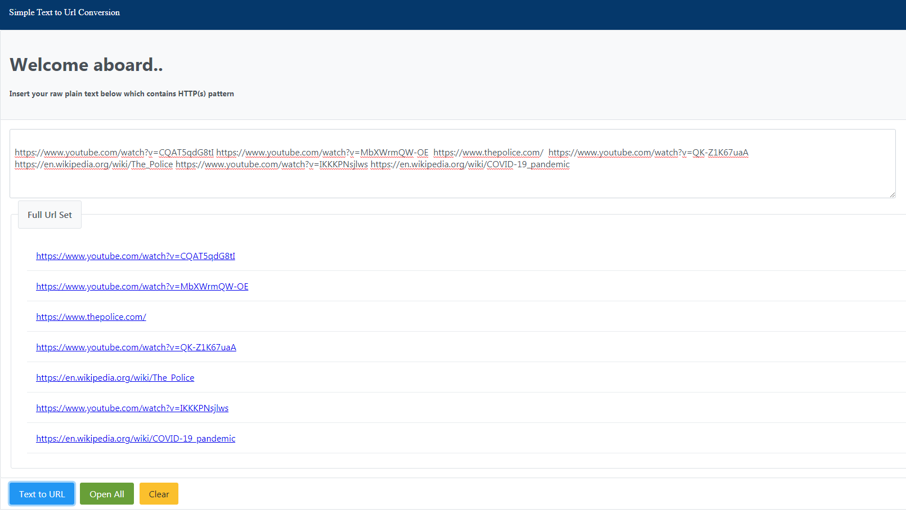

## Installation

Run `npm install` for installing related dependencies

## Development server

Run `ng serve` for a dev server. Navigate to `http://localhost:4200/`. The app will automatically reload if you change any of the source files.

## Serve

Run `ng serve` to serve the project.

## Purpose

Assumed that you have bulk set of url string. This util easily seperate url for visiting pages single visits. If you need bulk open all pages, you can use 'Open All' button.

## Example

Given Url String;

https://www.youtube.com/watch?v=CQAT5qdG8tI https://www.youtube.com/watch?v=MbXWrmQW-OE  https://www.thepolice.com/  https://www.youtube.com/watch?v=QK-Z1K67uaA 
https://en.wikipedia.org/wiki/The_Police https://www.youtube.com/watch?v=IKKKPNsjlws https://en.wikipedia.org/wiki/COVID-19_pandemic 
https://en.wikipedia.org/wiki/Workplace_hazard_controls_for_COVID-19
https://en.wikipedia.org/wiki/Human_population_planning
https://en.wikipedia.org/wiki/Sterilization_(medicine)

Expected Output

